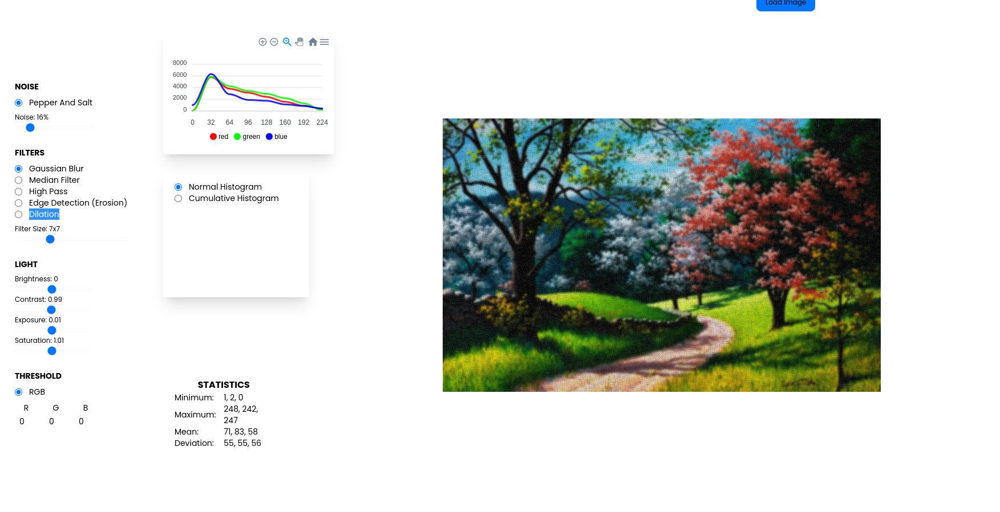
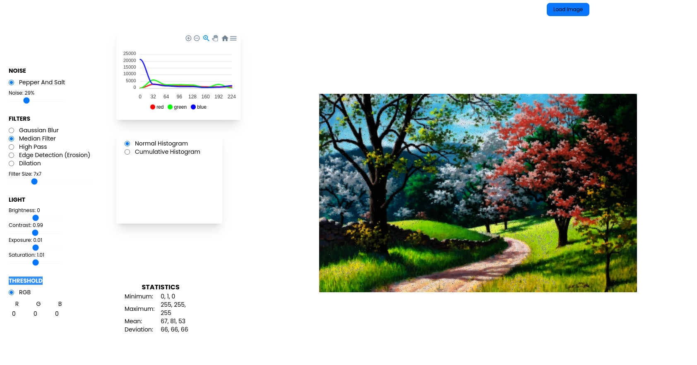
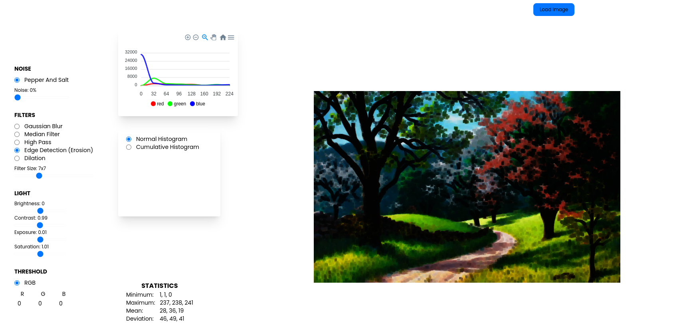
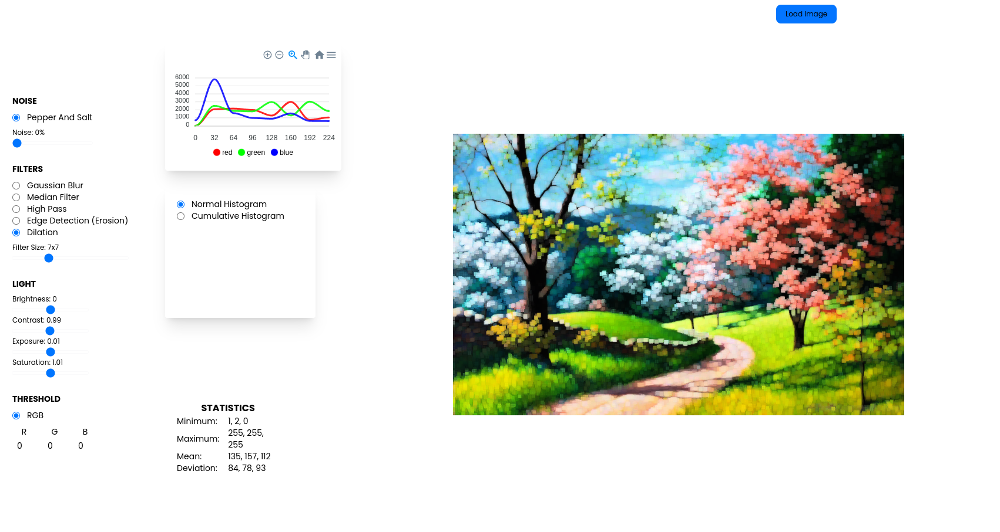
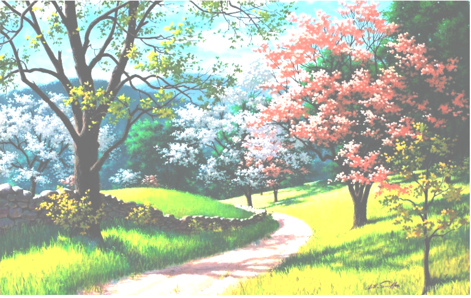
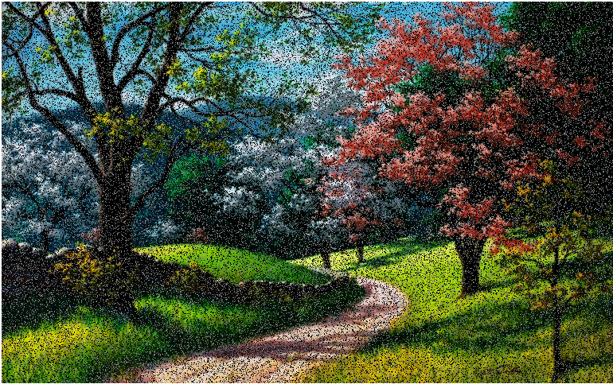
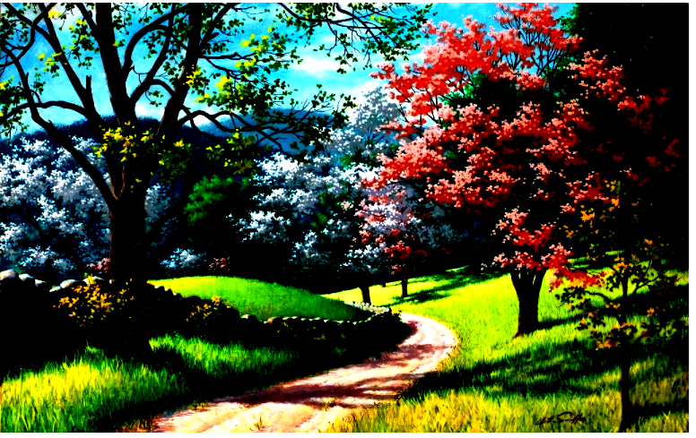
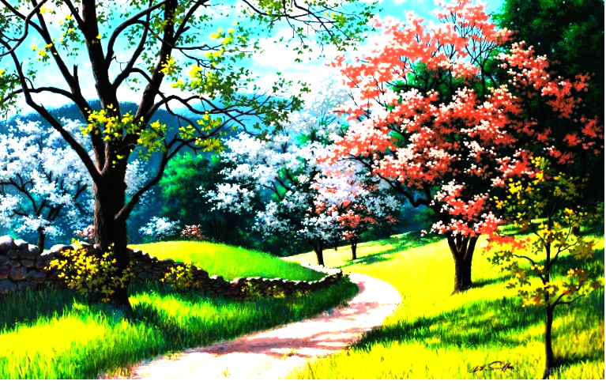

# <h1>GLSL ImageEditor</h1>

> Image Editor is a project that allows users to edit images using GLSL and React. It permits editing of images by adjusting contrast, brightness, and applying filters. Additionally, it provides image statistics and the histogram of the image.

## 🎨 Features

- Adjust contrast and brightness
- Apply filters (e.g. grayscale, sepia)
- Display image statistics (e.g. mean, standard deviation)
- Display image histogram
- Built with GLSL and React

## 📙 Installation

1) Clone the repository git clone (https://github.com/BorchaniSalma/Image-Editor.git)
2) Install dependencies npm install
## 🌏 Usage

|  Chrome |  Internet Explorer |  Edge |  Safari |  Firefox |
| :--------------------------------------------------------------------------------------------------------------------------------------------------------------: | :---------------------------------------------------------------------------------------------------------------------------------------------------------------------: | :----------------------------------------------------------------------------------------------------------------------------------------------------------: | :--------------------------------------------------------------------------------------------------------------------------------------------------------------: | :----------------------------------------------------------------------------------------------------------------------------------------------------------------: |
|                                                                               Yes                                                                                |                                                                                   10+                                                                                   |                                                                             Yes                                                                              |                                                                               Yes                                                                                |                                                                                Yes                                                                                 |

## 💪 Has full features that stick to the basic.

### Photo manipulation

- Mask Filter, Image Filter

### Integration function

- Image Load, Undo, Redo, Reset, Delete Object(Shape, Line, Mask Image...)

<table>
    <tbody>
        <tr>
            <th width="20%">Gaussian Blur</th>
            <th width="20%">Median Filter</th>
            <th width="20%">High Pass</th>
            <th width="20%">Edge Detection (Erosion)</th>
            <th width="20%">Dilation</th>
        </tr>
        <tr>
            <td></td>
            <td></td>
            <td></td>
            <td></td>
            <td></td>
        </tr>
    </tbody>
</table>

### Powerful filter function

- Brightness,Noise,Contrast,Exposure,Saturation,Threshold

| Brightness                                                                                                          | Exposure                                                                                                          | Contrast                                                                                                          | Noise                                                                                                          |
| ------------------------------------------------------------------------------------------------------------------ | -------------------------------------------------------------------------------------------------------------- | --------------------------------------------------------------------------------------------------------------- | ----------------------------------------------------------------------------------------------------------------- |
|  |  |  |  |

## 🙆 Easy to apply the size and design you want

### Can be used everywhere.

- Widely supported in browsers including IE10.
- Option to support various display sizes.
  (allows you to use the editor features on your web pages at least over **550 \* 450 sizes**)

